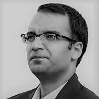

Mühendislik ve işletme lisansından sonra, işletme bölümünde Lisansüstü öğrenimime devam edip Ankara Üniversitesi Siyasal Bilgiler Fakültesi’nde “**Metin Madenciliği ile Sentiment Analizi ve Borsa İstanbul üzerinde bir Uygulama**” konulu doktora tezi ile doktoramı tamamladım. Ayrıca Stanford Üniversitesince Andrew Ng tarafından sunulan yapay zeka ile ilgili olan online kurs olan **Machine Learning** programını tamamladım. Yerli ve yabancı yayınlanmış akademik çalışmalarım bulunmaktadır. Bunun yanında, birçok kitap evinde halen satılan “**[Google App Engine altında Python ile web tasarım](https://www.amazon.com/Google-App-Engine-Suat-Atan/dp/6054205811/ref=sr_1_1?ie=UTF8&qid=1501056311&sr=8-1&keywords=suat+atan)** kitabının ve **[İktisat ve İşletmeciler için R ile Veri Analizi](https://www.seckin.com.tr/kitap/878575616#)** adlı kitapların yazarıyım. [Ağ analizi, Teori ve Uygulamalar a](https://www.seckin.com.tr/kitap/653978417)dlı kitabın ise editörlerinden biriyim.

  
İş yaşamıma 2005 yılında uluslararası bir müşavirlik firmasında başladım. İş hayatım boyunca içlerinde kendi kurduğum şirketimin de bulunduğu birkaç özel şirkette ve kamu kurumunda çalıştım. Ayrıca yazılım geliştirme ve web programlama yaptım. En başta Python ve R dilleri olmak üzere, Java ve Javascript gibi dilleri iyi derecede kullanmaktayım. Vue.js ve Jquery konusunda uzmanlaştım.

2009 yılından itibaren ise, 4 yılı Hazine Müsteşarlığı’nda Dış Ekonomik İlişkiler Genel Müdürlüğü’nde görevli olmak üzere, Tarım ve Kırsal Kalkınmayı Destekleme Kurumu’nda (TKDK) AB Fonlarının yönetilmesi ve uygulanması alanlarında uzman personel olarak çalıştım. Bu dönemde Hazine Müsteşarlığı web sayfasında yayınlanmış “Promethee Metodu ile Risk Bazlı Proje Seçimi” başlıklı bir çalışma raporum da bulunmaktadır. Aynı dönemde IPA fonlarının denetimi üzerine çalışmalarda bulundum. TKDK bünyesinde ayrıca yazılım geliştirme bölümünde de ASP.MVC projeleri üzerine çalıştım.

Halihazırda Akademik çalışmalarımı da aralıksız olarak sürdürüyorum. Yerli ve yabancı dergilerde yayınlanan çalışmalarım [şurada](https://scholar.google.com.tr/citations?user=KVQ0WVsAAAAJ&hl=tr). TED üniversitesinde "Social Network Analysis" adlı yüksek lisans dersi verdim ([https://www.tedu.edu.tr/tr/suat-atan](https://www.tedu.edu.tr/tr/suat-atan)) . Bunun yanında TED üniversitesi uygulamalı veri bilim merkezinde sosyal fayda için veri bilimi projesine katkılarımı sürdürüyorum. **İtalya'da Torino şehrinde, İtalya Hükumeti bursu ile Università degli Studi di Torino da, ekonomi ve iktisat bölümünde doğal dil işleme ve veri bilimi konusu üzerinde postdoktora çalışmalarımı tamamladim** ([https://www.est.unito.it/do/docenti.pl/Alias?suat.atan#tab-profilo](https://www.est.unito.it/do/docenti.pl/Alias?suat.atan#tab-profilo))

Şu anda Kanada'da özel bir şirkette data scientist(veri bilimci) ularak çalışıyorum.

İngilizce, Farsça, Kürtçe ve biraz Arapça ve İtalyanca konuşabiliyorum.

15 yıldan fazladır bu blogu tutuyorum. Tamamı özgün olan 700'den fazla yazı yazdım. Bu blog aslında herkesle paylaştığım bir açık belleği teşkil ediyor. Bu bellek sayesinde binbir emekle elde edilen bilgiler bir çırpıda unutlmak yerine ben ve blogu okuyacak herkes için kalıcı bir hafızaya dönüşüyor.

Meşhur yazar Borges'in cennet tanımı benim için de geçerli: "Cenneti çok büyük bir kütüphane olarak hayal ediyorum".

İletişim için suatatan+blog@gmail .com
